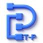

#  PET-P

中文 | **[English](./readme.md)**

[](./LICENSE.txt)

一个技术人员的 RPA 工具包 — 可配置的任务运行器、执行引擎、MCP 工具服务器，基于 Python 构建。
适用于 AI Agent、DevOps 和自动化测试。

**项目站点：** [PETP 项目介绍](https://petp.tail138025.ts.net/？lang=zh) | [WebApp 使用说明](./webapp/README.md)

**PET** = **P**ipeline-**E**xecution-**T**ask，层级化执行模型。末尾的 **P** 代表 **Processor**，每个处理器一一对应处理具体任务。

```
Pipeline  1:n Execution
Execution 1:n Task
Task      1:1 Processor
```

---

## 目录

- [功能特性](#功能特性)
- [截图](#截图)
- [快速开始](#快速开始)
- [依赖管理](#依赖管理)
- [运行模式](#运行模式)
- [HTTP 服务与 MCP](#http-服务与-mcp)
- [打包与 Docker](#打包与-docker)
- [Web App（Docker & UGOS）](#web-appdocker--ugos)
- [项目结构](#项目结构)
- [常见问题](#常见问题)
- [致谢](#致谢)
- [更新日志](#更新日志)

---

## 功能特性

将任务编排为 Execution（支持数据集循环、时间循环），将多个 Execution 组合为 Pipeline，单次运行或定时执行。

| 分类 | 能力 |
|------|------|
| **浏览器自动化** (Selenium) | 页面导航、后退、全屏、关闭 Chrome。查找元素后点击 / 输入 / 采集。批量查找（支持跳过）。iFrame、Cookie、截图。支持 Selenium IDE 录制转换。 |
| **SSH / SFTP** (Paramiko) | 创建 SSH / SFTP 会话。执行远程命令。上传 / 下载文件。 |
| **文件与文件夹** | 打开、写入、删除、读取文本。查找文件 / 最新文件。监控并自动移动。ZIP / UNZIP。文件选择对话框。 |
| **数据与表格** | 读取 CSV / Excel。写入 Excel。CSV 转 XLSX。采集、过滤、分组、映射、脱敏、转换。合并集合。 |
| **数据库 CRUD** | MySQL、PostgreSQL、SAP HANA、SQLite — 统一的 `DB_ACCESS` 处理器。 |
| **AI / LLM** | DeepSeek、Google Gemini、Ollama（本地）、智谱 Z.AI — 各支持初始化 + 问答 + MCP 工具调用。 |
| **MCP** | 将 PETP 作为标准 MCP 工具服务器暴露（Streamable-HTTP）。支持所有 LLM 提供商的 MCP 客户端处理器。 |
| **HTTP / 网络** | 可配置的 HTTP 请求。提取响应字段。内置 HTTP 服务（端口 8866）。OAuth2 / PKCE。 |
| **字符串工具** | 编码 / 解码（Base64、URL...）。哈希（MD5、SHA256...）。 |
| **鼠标与 GUI** (PyAutoGUI) | 在绝对或相对坐标位置点击、滚动、查询鼠标位置。 |
| **邮件** | 通过 SMTP 发送带附件的邮件。 |
| **数据可视化** | 通过 Matplotlib 生成图表。 |
| **媒体** | 下载 YouTube 视频（PyTube）。 |
| **执行控制** | 初始化 / 校验参数。嵌套执行。条件停止。等待 / 延时。运行时重载日志配置。读取 JSON。执行 Shell 命令。 |

---

## 截图

**macOS**


**Windows**


**HTTP 服务已启用**


**4 步运行第一个 Execution：**


**LLM MCP 服务器、客户端与宿主：**


**MCP 工具服务器（Streamable-HTTP）：**


**集成 Claude Code：**


---

## 快速开始

### 前置条件

| 需求 | 版本 | 说明 |
|------|------|------|
| Python | 3.14 | [下载](https://www.python.org/downloads/) |
| wxPython | 4.3.x | 须匹配 Python 版本 — 见第 2 步 |
| ChromeDriver | 与 Chrome 版本匹配 | 从 [Chrome for Testing](https://googlechromelabs.github.io/chrome-for-testing/) 下载，放入 `webdriver/<平台>/` |

> ChromeDriver 位置：`webdriver/darwin/chromedriver`（macOS）或 `webdriver/win32/chromedriver.exe`（Windows）

### 第 1 步 — 安装 Python

从 [python.org](https://www.python.org/downloads/) 下载安装 Python 3.14。

> Windows 安装时请勾选 **"Add Python to PATH"**。

### 第 2 步 — 安装 wxPython

wxPython 须精确匹配 Python 版本和操作系统。从 [wxpython.org/Phoenix/snapshot-builds](https://wxpython.org/Phoenix/snapshot-builds/) 下载对应的 `.whl` 文件：

| 平台 | 命令 |
|------|------|
| macOS (Apple Silicon) | `uv pip install --force-reinstall wxpython-4.3.0a16055+4fb35900-cp314-cp314-macosx_11_0_arm64.whl` |
| Windows | `uv pip install --force-reinstall wxpython-4.3.0a16055+4fb35900-cp314-cp314-win_amd64.whl` |

> 建议始终下载**最新快照版**以获得最佳兼容性。

### 第 3 步 — 安装依赖

详见 [依赖管理](#依赖管理)。快速安装：

```bash
# 推荐：使用 uv 安装
pip install -U uv

# 如果出现："No virtual environment found"
uv venv
# 创建虚拟环境于：.venv
# 激活方式：.venv\Scripts\activate

uv pip install -r requirements.txt

# 或只安装需要的分组（见[依赖分组](#依赖分组)）
uv pip install -r requirements/core.txt -r requirements/ssh-sftp.txt

# 备选：使用 pip 安装
pip install -r requirements.txt

# 或只安装需要的分组（见[依赖分组](#依赖分组)）
pip install -r requirements/core.txt -r requirements/ssh-sftp.txt
```

### 第 4 步 — 运行

```bash
python PETP.py
```

GUI 窗口将启动。首次运行会在 `./config/petpconfig.yaml` 创建默认配置。

### macOS 启动脚本（建议长时间运行时使用）

```bash
chmod +x scripts/macos/start_petp.sh scripts/macos/start_petp_gui.sh scripts/macos/start_petp_background.sh

# 统一入口（推荐）
./scripts/macos/start_petp.sh gui
./scripts/macos/start_petp.sh bg --run-execution ENDECODER --no-http

# 兼容旧脚本（仍可用）
./scripts/macos/start_petp_gui.sh
./scripts/macos/start_petp_background.sh --run-execution ENDECODER --no-http
```

两个脚本默认使用（仅在未预先设置时生效）：
- `PYTHONMALLOC=malloc`
- `PYTHONUNBUFFERED=1`
- `PYTHONDONTWRITEBYTECODE=1`

可选覆盖示例：

```bash
PYTHON_BIN=python3.14 PETP_ECHO_ENV=1 ./scripts/macos/start_petp.sh gui
PYTHONMALLOC=malloc ./scripts/macos/start_petp.sh background --run-pipeline MY_PIPELINE --no-http
```

---

## 依赖管理

PETP 采用**模块化依赖结构** — 按处理器类别拆分，灵活安装，按需打包。

### 使用 `uv` 安装（推荐）

[`uv`](https://docs.astral.sh/uv/) 是高性能 Python 包管理器（比 pip 快 10-100 倍）。与现有 requirements 文件完全兼容 — **零迁移成本**。

```bash

# 方案 A（推荐）：创建并使用虚拟环境
uv pip install -r requirements.txt

# 方案 B：显式安装到系统 Python
uv pip install --system -r requirements.txt

# 全量安装（GUI 桌面版）
uv pip install -r requirements.txt

# 后台服务（无 GUI）
uv pip install -r requirements-nogui.txt

# Docker（无头模式，无浏览器自动化）
uv pip install -r requirements-docker.txt

# 自定义组合
uv pip install -r requirements/core.txt -r requirements/ssh-sftp.txt -r requirements/http-client.txt
```

#### 使用 `uv pip compile` 锁定版本

生成带版本锁定的依赖文件，确保可复现构建：

```bash
# 编译单个分组
uv pip compile requirements/core.txt -o requirements/core.lock

# 编译全量依赖
uv pip compile requirements.txt -o requirements.lock
```

### 依赖分组

| 文件 | 分类 | 包 |
|------|------|-----|
| `core.txt` | 核心框架 | pyyaml, cryptocode, croniter, cron-descriptor, python-dateutil |
| `http-client.txt` | HTTP 请求 | requests, httpx, httpx-sse |
| `web-automation.txt` | 浏览器自动化 | selenium, urllib3, Pillow |
| `web-scraping.txt` | 网页抓取 | beautifulsoup4, lxml |
| `data-processing.txt` | JSON 处理 | jsonpath-python |
| `excel-data.txt` | Excel 与数据 | openpyxl, pandas |
| `chart.txt` | 可视化 | matplotlib |
| `document.txt` | 文档处理 | python-docx |
| `ssh-sftp.txt` | SSH / SFTP | paramiko |
| `gui-automation.txt` | 桌面自动化 | pyautogui, pyperclip |
| `gui-wxpython.txt` | 桌面 GUI | wxpython |
| `database.txt` | 数据库 | psycopg, mysql-connector-python, hdbcli（按需启用） |
| `ai-gemini.txt` | Google Gemini AI | google-genai |
| `ai-deepseek.txt` | DeepSeek AI | openai |
| `ai-ollama.txt` | Ollama 本地 LLM | ollama |
| `ai-zhipu.txt` | 智谱 Z.AI | zai |
| `mcp.txt` | MCP 协议 | mcp |
| `javascript.txt` | JS 引擎 | pythonmonkey |
| `video-download.txt` | 视频下载 | pytube |
| `http-service.txt` | HTTP 服务端 | fastapi, uvicorn |
| `webapp.txt` | Web 应用 | Flask, flask-httpauth, werkzeug, gunicorn |
| `system-build.txt` | 系统工具 | psutil, pyinstaller |

### 更新依赖

```bash
# 使用 pip
pip list --outdated | grep -v '^\-e' | cut -d = -f 1 | xargs -n1 pip install -U

# 使用 uv
uv pip install --upgrade -r requirements.txt
```

---

## 运行模式

| 模式 | 入口 | GUI | Selenium | 适用场景 |
|------|------|-----|----------|----------|
| 桌面 | `python PETP.py` | 有 | 有 | 本地开发、交互式 RPA |
| 后台 | `python PETP_backgroud.py` | 无 | 自动检测 | CLI、定时任务 |
| Docker | 容器内 `PETP_backgroud.py` | 无 | Headless | 服务器部署、CI/CD |

### 后台模式

```bash
# 启动后台服务
python PETP_backgroud.py

# 运行单个 Execution 后退出
python PETP_backgroud.py --run-execution ENDECODER --no-http
```

`petpconfig.yaml` 关键配置：

- `nogui_enabled: true`
- `nogui_ui_processor_policy: skip` — 跳过 GUI 处理器并继续
- `nogui_ui_processor_policy: abort` — 遇到 GUI 处理器时中止

**无 GUI 模式下跳过的处理器：**

| 类型 | 处理器 | 行为 |
|------|--------|------|
| 纯 GUI | `SHOW_RESULT`、`INPUT_DIALOG`、`MATPLOTLIB`、`FILE_CHOOSER` | 始终跳过 |
| 鼠标 | `MOUSE_CLICK`、`MOUSE_POSITION`、`MOUSE_SCROLL` | 始终跳过（需要显示器） |
| Selenium | `GO_TO_PAGE`、`FIND_THEN_*`、`SCREENSHOT` 等 | 自动检测 — 有 Chrome 则 headless 运行 |

> 在 Docker 外强制 headless：设置 `PETP_HEADLESS=true`

---

## HTTP 服务与 MCP

PETP 内置 HTTP 服务器，端口 **8866**。

| 端点 | 说明 |
|------|------|
| `GET /` | PETP HTTP 服务首页 |
| `GET /mcp` | MCP 工具服务器（Streamable-HTTP） |

MCP Inspector 设置：Transport Type = **Streamable HTTP**，URL = `http://localhost:8866/mcp`

---

## 打包与 Docker

### 打包可执行文件

```bash
python PETP_build.py
```

输出到 `./dist/`：macOS 生成 `PETP.app`，Windows 生成 `PETP.exe`。

### Docker

支持在 **Apple M1 (arm64) 构建**、在 **x86 (amd64) 运行**。

| 文件 | 用途 |
|------|------|
| `Dockerfile` | 多架构镜像（Python 3.14-slim） |
| `docker_build.sh` | 一键构建脚本（buildx + QEMU） |
| `requirements-docker.txt` | 无头模式依赖 |

```bash
# 本地构建并运行
./docker_build.sh
docker run --rm -p 8866:8866 petp-background:amd64-local

# 推送到仓库
./docker_build.sh --push yourrepo/petp-background:1.0
```

**容器端点：**

| 端点 | 说明 |
|------|------|
| `GET /health` | 健康检查 |
| `GET /petp/tools` | 列出 MCP 工具 |
| `POST /petp/exec` | 触发 Execution / Pipeline |
| `GET /petp/result?request_id=<id>` | 查询异步结果 |
| `POST /mcp` | MCP 工具服务器 |

## Web App（Docker & UGOS）

独立 Web App（`webapp/`）提供了完整的 Docker 打包说明，包含 UGOS（`linux/amd64`）的构建、导出、导入步骤：

- [`webapp/README.md`](./webapp/README.md)
- UGOS 快速路径：使用 `buildx` 构建 `linux/amd64`，校验架构后导出 tar，并在 NAS 使用 `docker load` 导入。

---

## 项目结构

### 根目录文件

| 分类 | 文件 | 说明 |
|------|------|------|
| 入口 | `PETP.py` | GUI 桌面入口 |
| | `PETP_backgroud.py` | 无头 / 后台入口 |
| 构建 | `PETP_build.py` | PyInstaller 构建（GUI） |
| | `PETP_background_build.py` | PyInstaller 构建（后台） |
| | `PETP_build_debug_runtime.py` | 调试辅助 |
| Docker | `Dockerfile` | 多架构镜像 |
| | `docker_build.sh` | 构建脚本 |
| | `.dockerignore` | 排除列表 |
| 依赖 | `requirements.txt` | 全量安装（引用所有分组） |
| | `requirements-nogui.txt` | 无 GUI / 后台服务 |
| | `requirements-docker.txt` | Docker / 无头模式 |
| | `requirements/*.txt` | 模块化依赖分组 |

### 目录结构

| 目录 | 说明 |
|------|------|
| `config/` | 配置（`petpconfig.yaml`） |
| `core/` | 核心引擎 — execution、pipeline、task、processor、loop、cron |
| `core/executions/` | YAML 执行定义 |
| `core/processors/` | 处理器实现（每个任务类型一个 `.py` 文件） |
| `core/pipelines/` | YAML 流水线定义 |
| `core/runtime/` | 后台 / 无 GUI 运行时逻辑 |
| `core/definition/` | YAML 读写器、Selenium IDE 转换器 |
| `httpservice/` | HTTP 服务器、MCP 处理器、请求路由 |
| `mvp/` | GUI 层（Model-View-Presenter） |
| `utils/` | 工具模块 — Selenium、Excel、Date、OS、Logger、Paramiko |
| `webapp/` | Flask Web 应用（Docker 与 UGOS 使用说明见 [`webapp/README.md`](./webapp/README.md)） |
| `webdriver/` | 平台 ChromeDriver 二进制文件 |
| `resources/` | 静态资源 |
| `download/` | 默认下载目录 |
| `testcoverage/` | 测试脚本 |
| `log/` | 运行日志 |

---

## 常见问题

| 问题 | 解决方案 |
|------|----------|
| `ModuleNotFoundError` | `pip install <包名>` 或安装对应的依赖分组 |
| wxPython 导入错误 | 确保 `.whl` 文件匹配 Python 版本和操作系统 |
| ChromeDriver 版本不匹配 | 从 [Chrome for Testing](https://googlechromelabs.github.io/chrome-for-testing/) 下载对应版本 |
| 端口 8866 被占用 | 在 `petpconfig.yaml` 中修改端口 |

---

## 致谢

- [wxPython](https://www.wxpython.org/) & [wxGlade](https://wxglade.sourceforge.net/)
- [Selenium](https://selenium-python.readthedocs.io/) & [ChromeDriver](https://googlechromelabs.github.io/chrome-for-testing/)

---

## 更新日志

### 2026

| 日期 | 更新内容 |
|------|----------|
| 2026-04 | 模块化依赖管理（`requirements/` 分组）；`uv` 支持 |
| 2026-04 | 无 GUI 模式、[`PETP_backgroud.py`](./PETP_backgroud.py)、[`Docker`](./Dockerfile) 支持 |
| 2026-04 | 工具栏：追加 `date_str`、`os.sep`；**跳过任务**复选框 |
| 2026-03 | 开箱即用：`OOTB_DOWNLOAD_LATEST_WXPYTHON`（macOS & Windows） |
| 2026-03 | [`FIND_MULTI_XXXProcessor`](./core/processors/FIND_MULTI_THEN_CLICKProcessor.py) 跳过功能 |
| 2026-03 | Selenium 页面加载超时支持 |
| 2026-02 | **MCP 工具服务器**（Streamable-HTTP）— [mcp_client_4_petp](./httpservice/mcp_client_4_petp.py) |
| 2026-01 | **智谱 Z.AI**：[SETUP](./core/processors/AI_LLM_ZHIPU_SETUPProcessor.py) / [Q&A](./core/processors/AI_LLM_ZHIPU_QANDAProcessor.py) / [MCP](./core/processors/AI_LLM_ZHIPU_QANDA_MCPProcessor.py) |

### 2025

| 日期 | 更新内容 |
|------|----------|
| 2025-10 | [STOPPERProcessor](./core/processors/STOPPERProcessor.py) / [RELOAD_LOGProcessor](./core/processors/RELOAD_LOGProcessor.py)；升级 Python 3.14 |
| 2025-06 | 开箱即用：`OOTB_AI_LLM_GEMINI_MCP` |
| 2025-05 | `ThreadingHTTPServer`；**高级输入对话框**；HTTP 服务（端口 8866） |
| 2025-05 | 开箱即用：`OOTB_AI_LLM_OLLAMA_MCP` / `OOTB_AI_LLM_DEEPSEEK_MCP` |
| 2025-04 | Execution 搜索、改进下拉框 |
| 2025-03 | ChromeDriver v134 |
| 2025-01 | 初始 **AI LLM** 支持：DeepSeek / Gemini / Ollama |

### 2024

| 日期 | 更新内容 |
|------|----------|
| 2024-10 | Python 3.13，ChromeDriver 130 |
| 2024-08 | [MATPLOTLIBProcessor](./core/processors/MATPLOTLIBProcessor.py)、[AI_LLM_OLLAMA_QANDAProcessor](./core/processors/AI_LLM_OLLAMA_QANDAProcessor.py)、[RUN_EXECUTIONProcessor](./core/processors/RUN_EXECUTIONProcessor.py) |
| 2024-07 | Gemini AI-LLM；[DATA_MULTI_MASKINGProcessor](./core/processors/DATA_MULTI_MASKINGProcessor.py)；任务跳过 |
| 2024-06 | [DATA_GROUPBYProcessor](./core/processors/DATA_GROUPBYProcessor.py)、[DATA_MASKINGProcessor](./core/processors/DATA_MASKINGProcessor.py) |
| 2024-05 | HttpServer（GET/POST、JSON） |
| 2024-04 | PyInstaller 构建后按需加载处理器 |
| 2024-03 | PyInstaller 打包 macOS & Windows 可执行文件 |
| 2024-02 | [PETP 文件查看器](./webapp/README.md) Web 应用（Flask） |
| 2024-01 | 启动时自动执行 |

### 2023

| 日期 | 更新内容 |
|------|----------|
| 2023-12 | `DATA_COLLECT`、`DATA_MAPPING`、`FIND_MULTI_THEN_CLICK`、`FOLDER_WATCH_MOVE` 处理器 |
| 2023-11 | [ENCODE_DECODE_STRProcessor](./core/processors/ENCODE_DECODE_STRProcessor.py)、[HASH_STRProcessor](./core/processors/HASH_STRProcessor.py)、[DATA_FILTERProcessor](./core/processors/DATA_FILTERProcessor.py)、[COLLECTION_MERGEProcessor](./core/processors/COLLECTION_MERGEProcessor.py)；运行时日志级别；滚动文件处理器 |
| 2023-10 | Python 3.12 |
| 2023-09 | DB_ACCESS：MySQL / PostgreSQL / SAP HANA / SQLite |
| 2023-04 | `PYTUBEProcessor` — YouTube 下载 |

### 2022

| 日期 | 更新内容 |
|------|----------|
| 2022-11 | UI 简化与事件绑定清理 |
| 2022-10 | 非阻塞 GUI 执行 |
| 2022-09 | 恢复上次运行；`MOUSE_CLICKProcessor`、`MOUSE_SCROLLProcessor` |
| 2022-07 | MySQL 支持；Selenium 4.3.0 |
| 2022-06 | Python 3.10、wxPython 4.1.2 |
| 2022-05 | Mac M1 wxPython 修复 |
| 2022-04 | `ZIPProcessor` |
| 2022-03 | 循环 N 次模式 |

### 2021

| 日期 | 更新内容 |
|------|----------|
| 2021-10 | [BEAUTIFUL_SOUPProcessor](./core/processors/BEAUTIFUL_SOUPProcessor.py) |
| 2021-09 | 表格复制粘贴 |
